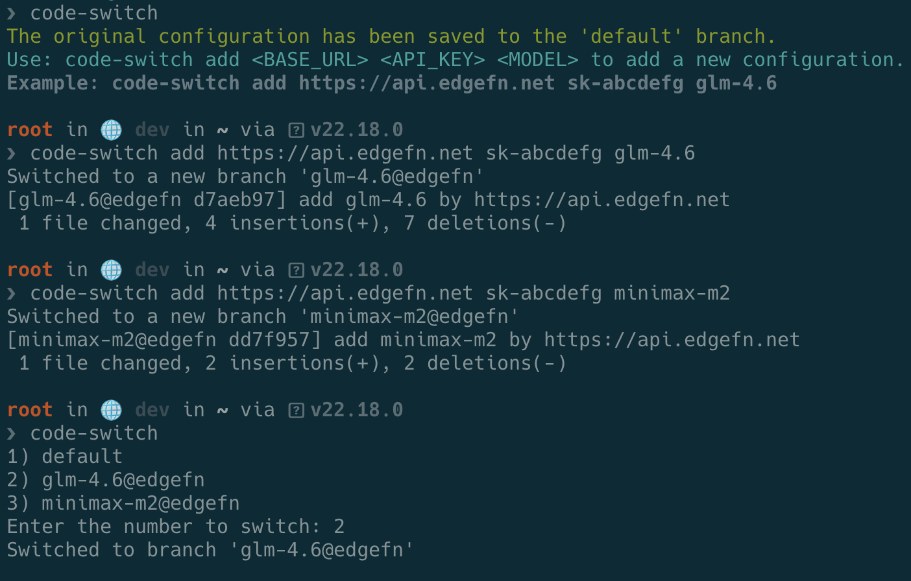

# Code Switch 🚀

**仅用 100+ 行代码实现的 Claude Code 配置管理神器**

一个精简而强大的配置切换工具，通过硬链接 + Git 分支的巧妙组合，让您在不同 AI 服务提供商和模型之间实现快速切换配置。

## ✨ 核心亮点

### 🔥 **极致精简**
- **100+ 行代码**：整个工具仅用一个脚本文件实现
- **零依赖**：除了系统自带的 `jq`，无需额外依赖
- **单文件部署**：一个脚本搞定所有功能

### 🔗 **硬链接巧思**
- **配置链接**：将 `~/.claude/settings.json` 硬链接到 Git 仓库
- **实时同步**：配置更改立即生效，无需复制粘贴
- **原生存储**：利用文件系统原生特性，安全可靠

### 🌲 **Git 分支魔法**
- **分支即配置**：每个 Git 分支存储一套完整配置
- **瞬间切换**：`git checkout` 实现毫秒级配置切换
- **版本管理**：享受 Git 的完整版本控制能力

## 使用示例


## 📦 安装方式

### 一键安装（推荐）

```bash
curl -sSL https://raw.githubusercontent.com/onewesong/code-switch/refs/heads/master/code-switch.sh -o /usr/bin/code-switch && chmod +x /usr/bin/code-switch && code-switch
```

## 🚀 使用方法

### 基本命令

| 命令 | 功能描述 |
|------|----------|
| `code-switch` | 交互式切换配置 |
| `code-switch add <URL> <KEY> <MODEL>` | 添加新配置 |
| `code-switch delete <MODEL>@<DOMAIN>` | 删除配置 |
| `code-switch check` | 查看当前配置 |

### 添加配置

```bash
# 添加新的 AI 服务配置
code-switch add https://api.edgefn.net sk-abcdefg glm-4.6
```

### 切换配置

```bash
# 交互式选择配置
code-switch
```

运行后会显示可用配置列表：
```
1) glm-4.6@api.edgefn
2) gpt-4@openai.com
3) default
Enter the number to switch:
```

## 🔧 技术实现

### 核心原理

这个工具的精髓在于三个关键技术的巧妙结合：

#### 1. 硬链接机制
```bash
# 创建硬链接，让两个文件名指向同一个 inode
ln ~/.claude/settings.json ~/.code-switch/settings.json
```

#### 2. Git 分支管理
```bash
# 每个配置对应一个分支
git checkout -b "glm-4.6@edgefn"
git commit -m "add glm-4.6 configuration"
```

#### 3. 配置切换
```bash
# 切换分支 = 切换配置
git checkout "gpt-4@openai"
```


## 📝 使用示例

### 示例 1：多服务商配置

```bash
# 添加 GLM 配置
code-switch add https://api.edgefn.net sk-glm-key glm-4.6

# 添加 OpenAI 配置
code-switch add https://api.openai.com sk-openai-key gpt-4

# 添加本地服务配置
code-switch add http://localhost:8080 local-key local-model
```

### 示例 2：快速切换

```bash
$ code-switch
1) glm-4.6@edgefn
2) gpt-4@openai
3) local-model@localhost
Enter the number to switch: 1
Switched to branch 'glm-4.6@edgefn'
```

**切换瞬间完成！** 因为这只是 Git 分支切换，配置文件通过硬链接自动更新。

### 示例 3：配置管理

```bash
# 查看当前配置
code-switch check

# 删除不需要的配置
code-switch delete local-model@localhost

# 切换回原始配置
code-switch  # 选择 default 分支
```

## ⚡ 性能优势

### 传统方式 vs Code Switch

| 操作 | 传统方式 | Code Switch |
|------|----------|-------------|
| 配置切换 | 手动编辑文件 | Git 分支切换 |
| 切换时间 | 几分钟 | **几秒** |
| 配置备份 | 手动备份 | **Git 自动管理** |
| 版本历史 | 无 | **完整 Git 历史** |
| 配置安全 | 容易丢失 | **Git 版本控制** |


## 🛠️ 故障排除

### 常见问题


**Q: 硬链接失效**
```bash
# 检查链接状态
ls -la ~/.claude/settings.json
# 重新初始化
rm -rf ~/.code-switch && code-switch
```

**Q: Git 分支冲突**
```bash
# 强制切换
cd ~/.code-switch && git checkout -f branch-name
```

## 💡 设计理念

### KISS 原则
- **Keep It Simple, Stupid**：用最简单的方式解决复杂问题
- **单文件**：所有功能集中在一个脚本中
- **零配置**：开箱即用，无需复杂配置

### 利用现有工具
- **Git**：成熟的版本控制系统
- **硬链接**：文件系统原生特性
- **jq**：标准的 JSON 处理工具

### 优雅的解决方案
- **不重复造轮子**：充分利用现有生态
- **组合创新**：简单技术的巧妙组合
- **用户友好**：直观的命令行界面，交互式切换模型渠道

## 🤝 贡献指南

欢迎提交 Issue 和 Pull Request！

1. Fork 本仓库
2. 创建特性分支：`git checkout -b feature/new-feature`
3. 提交更改：`git commit -am 'Add new feature'`
4. 推送分支：`git push origin feature/new-feature`
5. 提交 Pull Request

## 📄 许可证

本项目采用 MIT 许可证 - 查看 [LICENSE](LICENSE) 文件了解详情。

---

**用 100+ 行代码，实现配置管理的极致体验！** 🎉